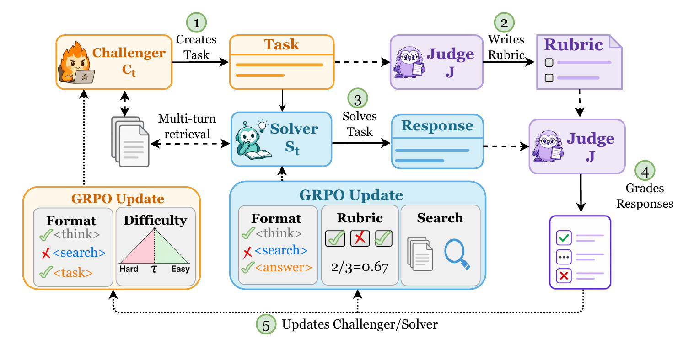
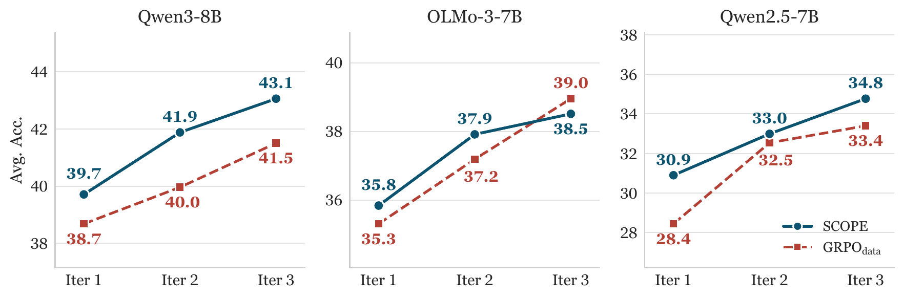
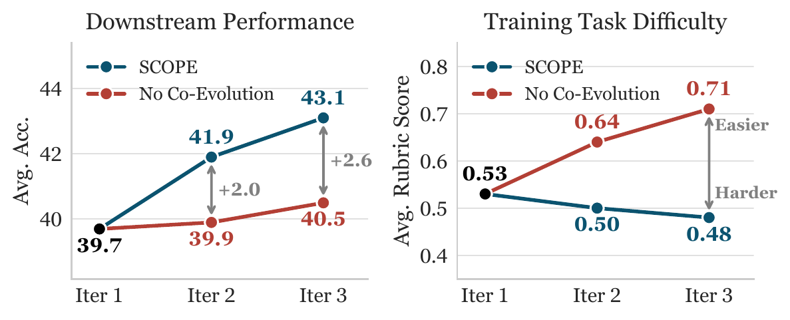
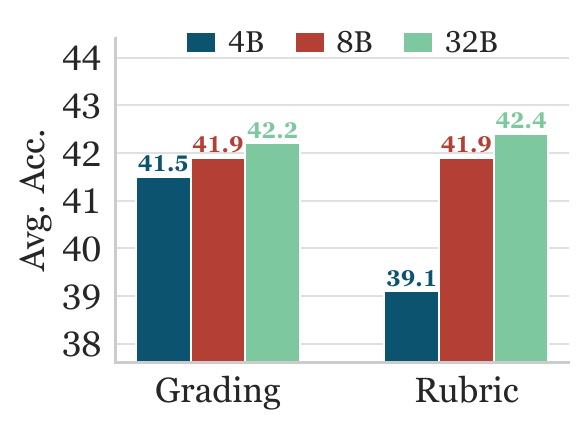

<div align="center">

# SCOPE: Self-Play via Co-Evolving Policies for Open-Ended Tasks

Code for reproducing SCOPE, a self-play training pipeline for open-ended tasks.

[](https://arxiv.org/abs/2605.31433)
[](https://edinburghnlp.github.io/scope/)
[](https://huggingface.co/collections/wckwan/scope)
[](https://wandb.ai/cyruskwan/SCOPE/table)

</div>

## Overview

SCOPE is a data-free self-play framework for open-ended tasks. It co-evolves two policies initialized from the same base model: a Challenger that generates document-grounded tasks and a Solver that answers them through multi-turn retrieval.

A frozen copy of the initial model serves as the self-judge. The Judge applies quality gates, writes task-specific rubrics from the source document, and grades Solver responses. The Challenger and Judge see the source document; the Solver sees only the task and must recover the missing evidence through retrieval.

<p align="center">
  
</p>

Each self-play iteration has two training stages:

1. **Train Challenger**: for each source document, the Challenger produces a retrieval-augmented task. The Judge gates the task, writes rubrics, and grades rollouts from the previous Solver. The Challenger reward combines format compliance with a difficulty reward that peaks when the Solver's mean rubric score is near 0.5.
2. **Train Solver**: the trained Challenger generates candidate tasks over fresh corpus samples. Candidate tasks are filtered by Judge quality gates and previous-Solver difficulty estimates, then the Solver trains with GRPO using a length-controlled rubric reward plus format and search rewards.

## Main Results

### Matches Curated-Data Training

<p align="center">
  
</p>

Across three 7-8B models, SCOPE improves open-ended benchmark averages monotonically across iterations and matches or exceeds `GRPO_data`, a baseline trained on about 9K curated prompts with frontier-model rubrics, without using curated prompts.

Self-play also builds transferable skills: short-form QA improves by +7.8 to +13.8 points despite zero short-form training.

| Average gain at iter-3 | Qwen2.5-7B | Qwen3-8B | OLMo-3-7B |
| --- | ---: | ---: | ---: |
| Open-ended benchmarks | +10.4 | +5.4 | +7.8 |
| Short-form QA | +13.8 | +7.8 | +9.2 |

### The Challenger Must Co-Evolve

<p align="center">
  
</p>

A frozen Challenger quickly produces tasks the improving Solver outgrows. With co-evolution, task difficulty stays near the target frontier and downstream gains keep accumulating.

### The Solver Learns Retrieval And Synthesis

A controlled replay swaps one component at a time from the iter-3 Solver into the iter-1 Solver. Both swaps improve performance, showing that SCOPE teaches the Solver to find better evidence and use it better.

| Probe | Avg. delta | Takeaway |
| --- | ---: | --- |
| Iter-3 answer generator, iter-1 search | +2.1 | Better synthesis from fixed evidence. |
| Iter-3 search, iter-1 answer generator | +1.7 | Better evidence gathering, especially on multi-hop QA. |

### Rubric Quality Bottlenecks The Self-Judge

<p align="center">
  
</p>

Scaling the grader helps little once rubrics are specific and document-grounded. The rubric writer matters more: weak rubric generation gives generic criteria that the Solver can satisfy without learning the task.

## Getting Started

### Requirements

- **Hardware**: 6x NVIDIA H100 80GB or equivalent. The default scripts use GPUs 0-1 for retrieval/inference servers and GPUs 2-5 for training.
- **Software**: Python 3.10, CUDA 12.x, PyTorch 2.x.
- **Corpus**: Wikipedia corpus plus FAISS index, about 75 GB total. See [corpus/README.md](corpus/README.md).

### Installation

```bash
pip install -r requirements.txt
```

Set API keys in `.env`:

```bash
echo "WANDB_API_KEY=your_key" >> .env
echo "OPENAI_API_KEY=your_key" >> .env
```

### Data Preparation

Prepare the Wikipedia corpus and FAISS index by following [corpus/README.md](corpus/README.md).

Build the validation parquet in the prompt format for the model you will run:

```bash
# Qwen2.5-7B-Instruct
python scope/prepare_validation_data.py --format qwen2.5

# Qwen3-8B
python scope/prepare_validation_data.py --format qwen3

# OLMo-3-7B-Instruct
python scope/prepare_validation_data.py --format olmo3
```

These commands write `data/validation_qwen25.parquet`, `data/validation_qwen3.parquet`, and `data/validation_olmo3.parquet`, respectively.  

## Running Training

Run one model-specific training script:

```bash
# Qwen2.5-7B-Instruct
bash training/train_qwen25_7b.sh

# Qwen3-8B
bash training/train_qwen3_8b.sh

# OLMo-3-7B-Instruct
bash training/train_olmo3_7b.sh
```

## Evaluation

Evaluate with the matching model family:

```bash
# Qwen2.5-7B-Instruct
MODEL_FAMILY=qwen25 \
HF_CHECKPOINT=path/to/qwen25_checkpoint \
STEP=40 \
bash eval/eval_standalone.sh

# Qwen3-8B
MODEL_FAMILY=qwen3 \
HF_CHECKPOINT=path/to/qwen3_checkpoint \
STEP=40 \
bash eval/eval_standalone.sh

# OLMo-3-7B-Instruct
MODEL_FAMILY=olmo3 \
HF_CHECKPOINT=path/to/olmo3_checkpoint \
STEP=40 \
bash eval/eval_standalone.sh
```

`eval/eval_standalone.sh` selects the matching validation parquet, rollout format, stop tokens, and chat template. It uses GPT via the OpenAI API to grade outputs, so `OPENAI_API_KEY` must be set.

## Citation

```bibtex
@article{kwan2026scope,
  title   = {SCOPE: Self-Play via Co-Evolving Policies for Open-Ended Tasks},
  author  = {Kwan, Wai-Chung and Gema, Aryo Pradipta and
             Leang, Joshua Ong Jun and Minervini, Pasquale},
  journal = {arXiv preprint arXiv:2605.31433},
  year    = {2026}
}
```

## Attribution

This implementation builds on [verl](https://github.com/verl-project/verl).
